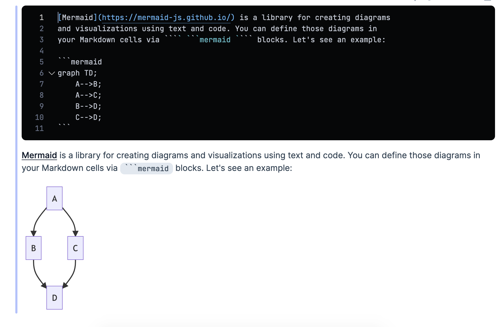
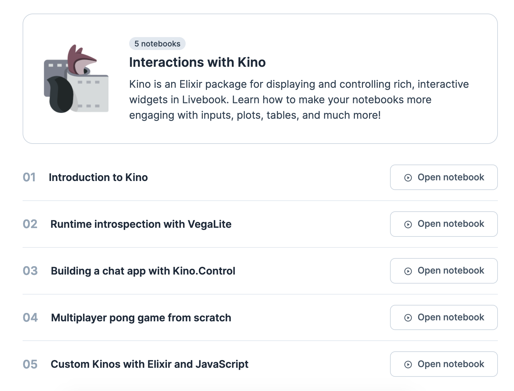

Livebook v0.5 is out with a number of goodies! We have recorded a video showing how to use those features to build chat apps, multiplayer games, and more:

<div class="embed">
  <iframe src="https://www.youtube.com/embed/5tLsBwAjOo0?rel=0" title="Video" allowfullscreen loading="lazy"></iframe>
</div>

In case you can't watch it, here is a rundown of the biggest features.

## Flowcharts with Mermaid.js

Many teams are using Livebook for documentation. v0.5 improves on this use case by allowing users to embed [Mermaid.js](https://mermaid-js.github.io/) diagrams and visualizations:



Define your Mermaid.js definitions inside ` ```mermaid ` blocks and you are good to go!

## Custom widgets

You can now add your own widgets to Livebook, known as _Kinos_ in Livebook terminology. Build chat apps, multiplayer games, interactive maps, and more! It doesn't matter what is your domain area, you can now make Livebook as powerful as you want.

We have revamped our Explore guides to include a complete course on Kino with several examples:



## Other improvements

*   You can now increase the editor font-size and pick a high-contrast theme. We also improved the contrast and accessibility in several places.

*   The code editor now supports auto-completion of structs fields and shows additional metadata about functions, such as which version they were added and deprecation notices.

Check out [the technical release notes](https://github.com/livebook-dev/livebook/releases/tag/v0.5.0) for the complete list of changes.
