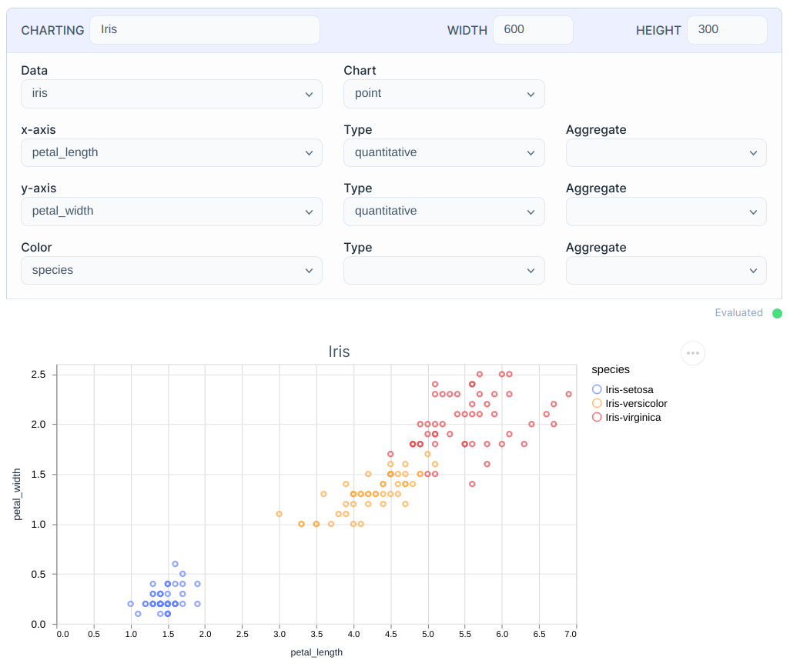
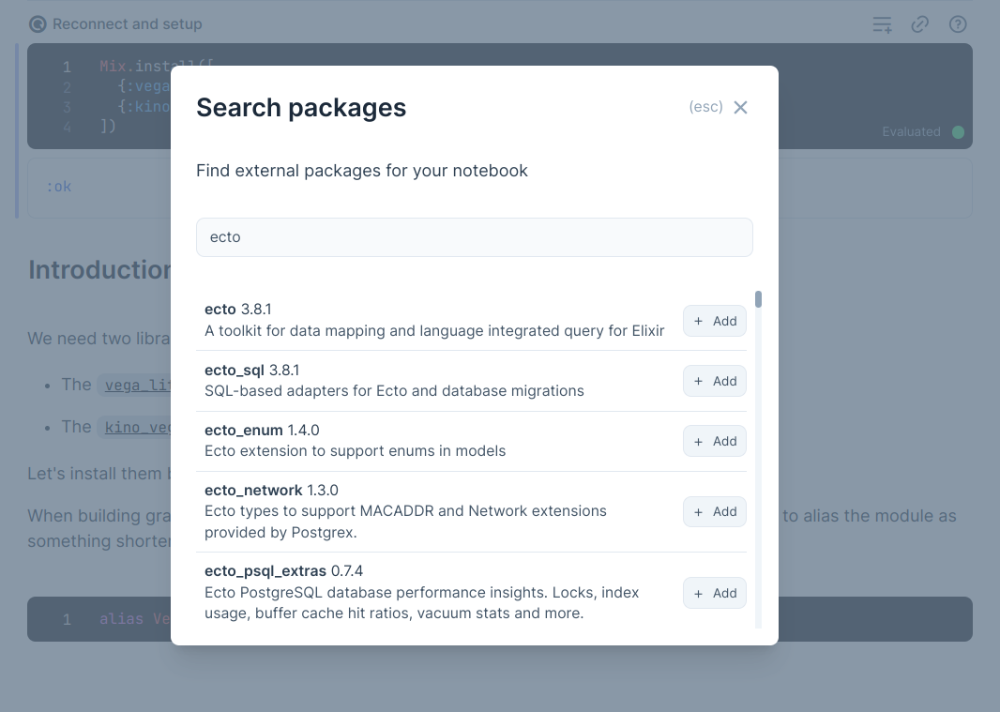
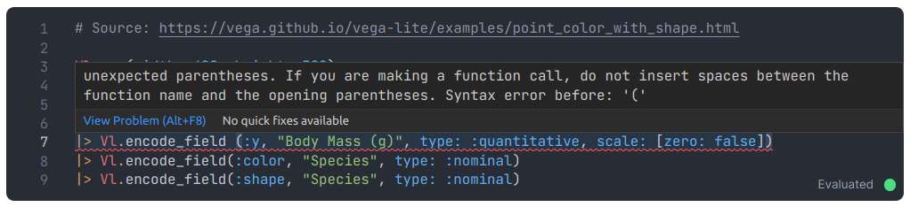
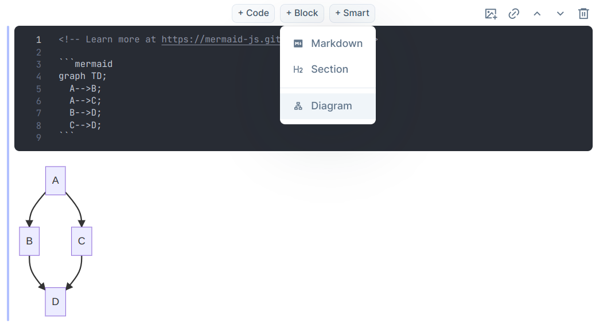

Livebook v0.6 is out with a number of exciting features! Join us, as we go from a database connection to charting the data in a few simple steps:

  <iframe src="https://www.youtube.com/embed/4hVIxyHxwK8?rel=0" title="Video" allowfullscreen loading="lazy"></iframe>

Below is a quick overview of the biggest features in this new version.

## Smart cells

Livebook v0.6 introduces a new type of cells to help you automate and master entire coding workflows! Smart cells are UI components for performing high-level tasks, such as charting your data:

We already have a couple Smart cells - including connection to PostgreSQL and MySQL - but the best part is that anyone can create new Smart cells and share with the community. We can't wait to automate workflows from HTTP requests to Machine Learning models!

## Package search

The new version also brings a much more integrated dependency management, including the new package search and the setup cell:

## Error highlighting

You will also find better error reporting! Spot typos and syntax errors right away with the new squiggly lines:

## Streamlined diagrams

In the previous release we introduced support for Mermaid.js diagrams in Markdown cells. It's now even easier with the new Diagram button:

## There's more

There are many other notable features, including "code zen" and persistent configuration. Check out [the technical release notes](https://github.com/livebook-dev/livebook/releases/tag/v0.6.0) for the complete list of changes.
