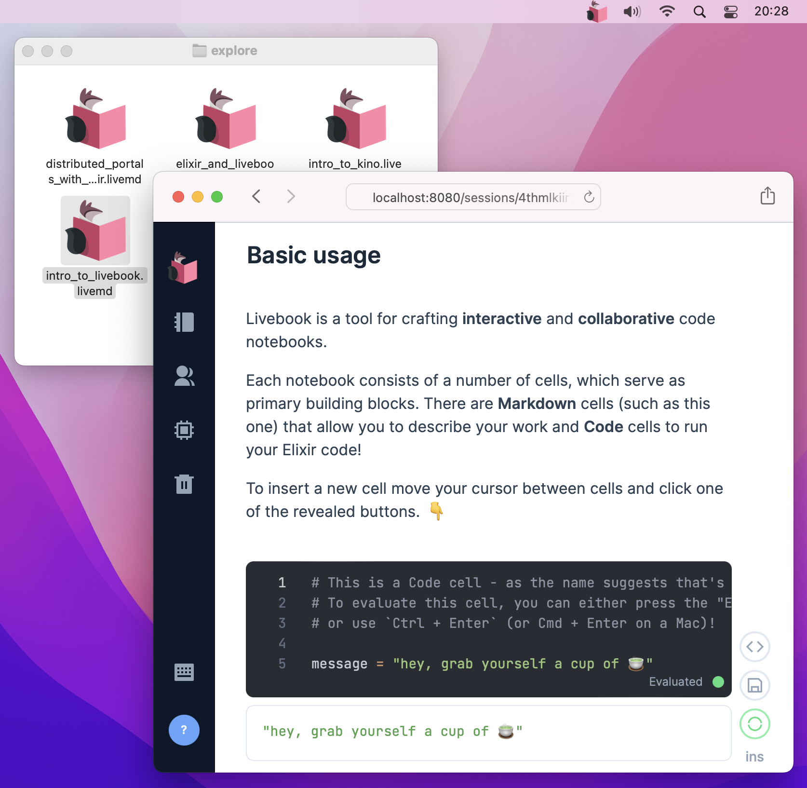

We want Livebook to be accessible to as many people as possible. Before this release, installing Livebook on your machine could be considered easy, especially if you already had Elixir installed.

But imagine someone who's not an Elixir developer. They had to either install Docker or Elixir before getting started with Livebook. And if they are in their first steps as developers, even using a terminal could be demanding.

That's why we built [Livebook desktop](/#install). It's the simplest way to install Livebook on your machine.

Livebook desktop doesn't require the person to have Elixir previously installed on their machine. And it works both on the Mac and Windows.

We hope that the desktop app enables way more people to try Livebook.

For example, let's say you want to help your friend to start learning Elixir. You can tell that person to download Livebook desktop and follow the built-in "Distributed portals with Elixir" notebook, a fast-paced introduction to Elixir.

Or maybe for the data scientist that heard about Livebook and wants to try it. That person can download Livebook desktop and learn how to do data visualization in Livebook with the built-in "Plotting with VegaLite" and  "Maps with MapLibre" notebooks.

If you want to try the Livebook desktop app, it's just [one click away](/#install).

We hope you enjoy it! 😊
