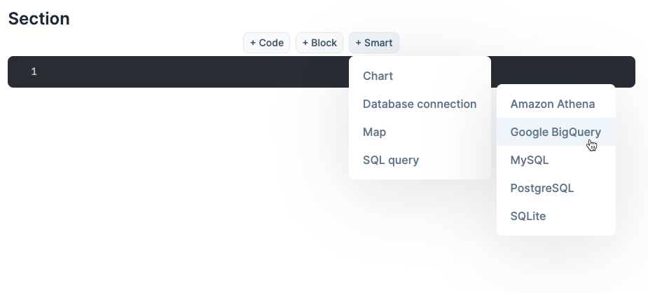
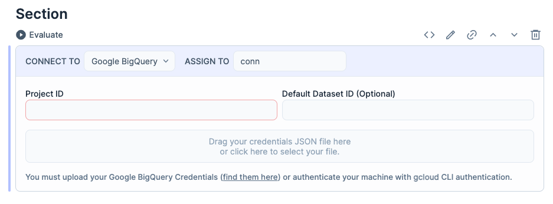
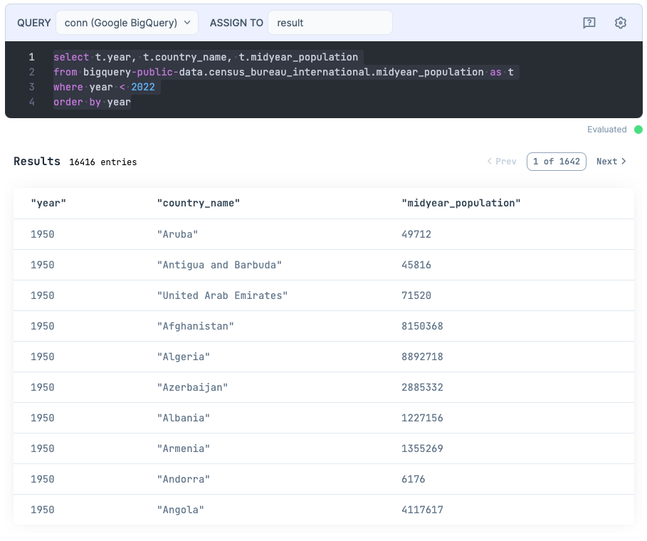
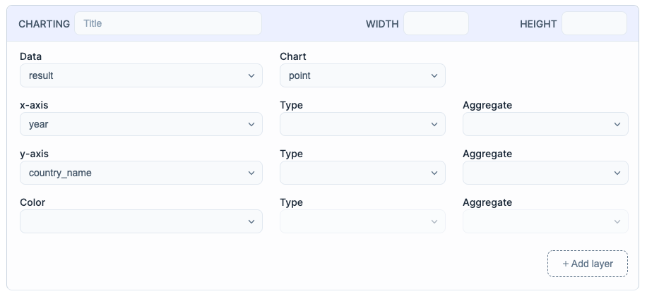
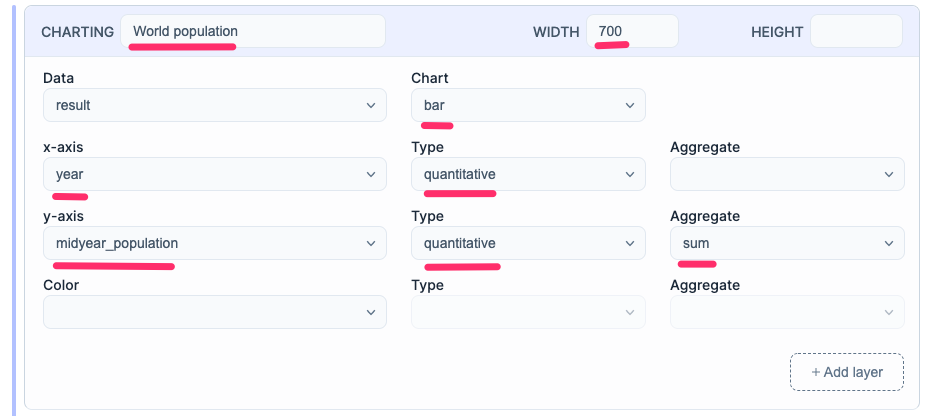
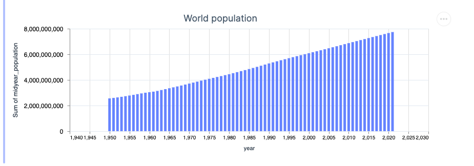
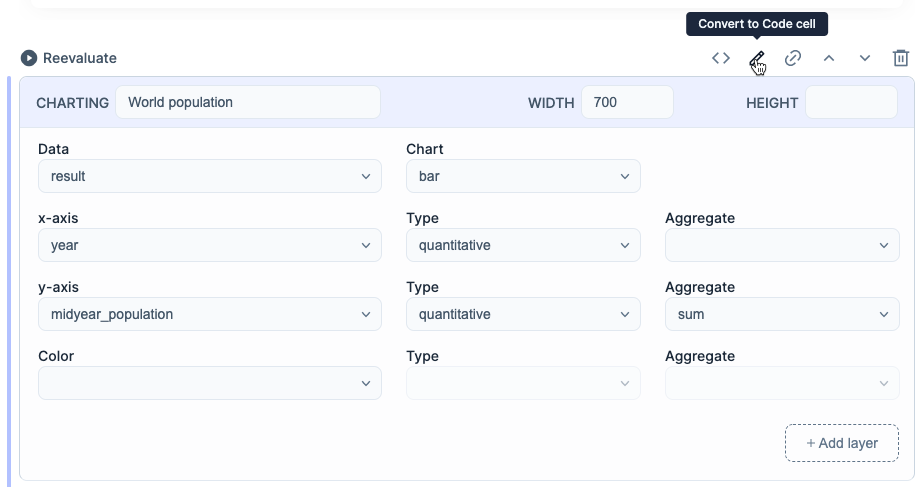
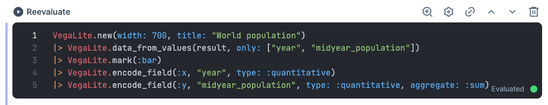

Querying and visualizing data from a database is a common and recurring task. That's the kind of thing you don't want to repeat yourself, writing the same code repeatedly. That's where Livebook Smart cells come in. It helps you to automate any workflow you want.

Livebook has built-in Smart cells that help you query and visualize data from multiple databases, like PostgreSQL, MySQL, Google BigQuery, AWS Athena, and SQLite.

This article explains how to use Livevook Smart cells to query and visualize data from a Google BigQuery dataset.

If you like video format, here's a video version of this article:

<div class="embed">
  <iframe src="https://www.youtube.com/embed/F98OWdigCjY?rel=0" title="Video" allowfullscreen loading="lazy"></iframe>
</div>

You can also run this tutorial inside your Livebook instance:

[](/run?url=https%3A%2F%2Fraw.githubusercontent.com%2Fhugobarauna%2Flivebook-notebooks%2Fmain%2Flivebook_google_big_query.livemd)

## Connecting to Google BigQuery using the Database connection Smart cell

Before connecting to a Google BigQuery dataset, you need to create a Google Cloud service account and a service account key. Follow [the steps in this guide](https://cloud.google.com/docs/authentication/getting-started) and download the generated service account key JSON file. That file contains the info needed to configure a connection to Google BigQuery.

Now, create a new notebook. Then, let's create a Google BigQuery connection using a Database connection smart cell. Click the options "Smart > Database connection > Google BigQuery":



Once you've done that, you'll see a Smart cell with input fields to configure your Google BigQuery connection:



Configure your Google BigQuery connection by following the instructions inside the Smart cell:

*   Add your Google Cloud Project ID
*   Upload your JSON credentials file

> **Pro tip:** if you have an authenticated [gcloud CLI](https://cloud.google.com/sdk/gcloud) in the machine running your Livebook instance, then Livebook will automatically pick up your Google Cloud credentials and use it for access. No need to upload the JSON file. 😉

Now, click the "Evaluate" icon to run that Smart cell. Once you do that, the Smart cell will configure the connection and assign it to a variable called `conn`.

## Querying Google BigQuery using the SQL Query smart cell

Now, let's use your Google BigQuery connection to query a Google BigQuery public dataset.

Add a new SQL Query smart cell by clicking the options "Smart > SQL Query":


Once done, you can write and execute a SQL query inside that cell. Let's query a public Google BigQuery dataset.

Copy the following query to the cell:

```sql
select t.year, t.country_name, t.midyear_population
from bigquery-public-data.census_bureau_international.midyear_population as t
where year < 2022
order by year
```

And execute the cell. The Smart cell will execute the query and assign its result to a variable called `result`. It also will show you the result of the query in a table format, like this:



## Visualizing data from Google BigQuery using the Chart smart cell

Now we can visualize the result from that query using a Chart smart cell.

Add a new Chart smart cell by clicking the option "Smart > Chart":


Your newly created Chart smart cell will look something like this:



Now, let's use that cell to visualize the results from our query.

The query we wrote returned the population per year per country from the International Census Data, which is published as a Google BigQuery public dataset. We can use that data to visualize how the world population has been growing over the years.

Use your Chart smart cell to configure:

*   the chart's title
*   the chart's width
*   the chart's type
*   the x-axis and its type
*   the y-axis, its type, and aggregate



Once you've configured the cell, you can evaluate it, and it will build a chart for you. It will look something like this:



That's it! Using Livebook Smart cells, you can connect to a Google BigQuery dataset, execute a SQL query and visualize the results with a chart. And since this is quite a common task, Smart cells enable you to do that without writing a single line of code!

And, if you need more customization in any part of the process, easy peasy. You can easily convert a Smart cell to a code cell and edit the code generated for you. To do that, click in a Smart cell, and then click the "Convert to Code cell" icon:



When you click the "Convert to Code cell" icon, it will transform your Smart cell into a Code cell. You'll be able to see the code that was running behind the Smart cell and edit it as you like:


