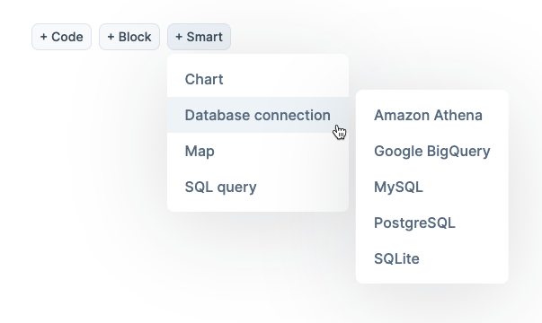
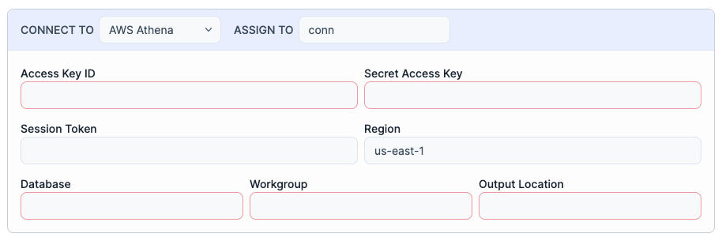
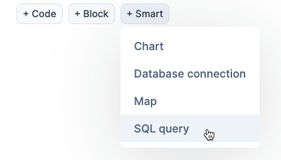
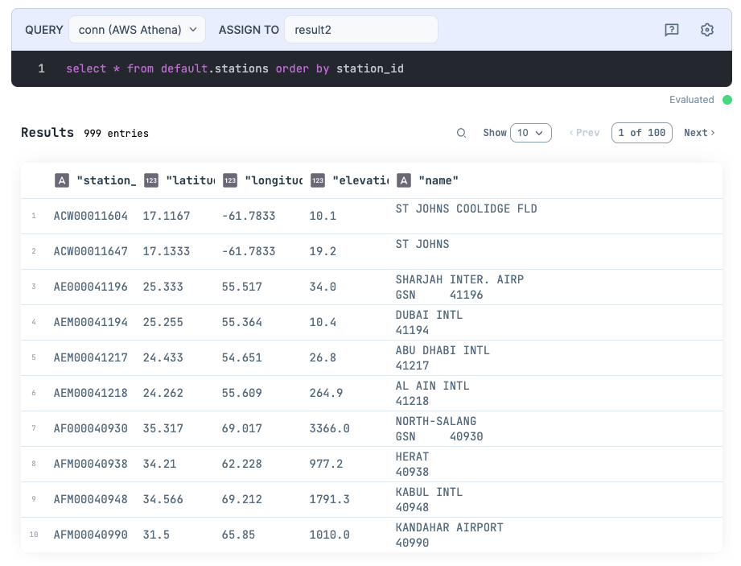
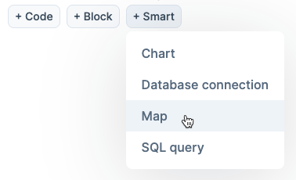
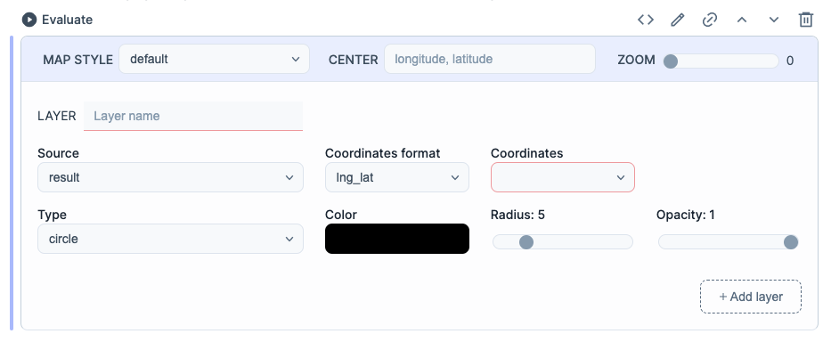
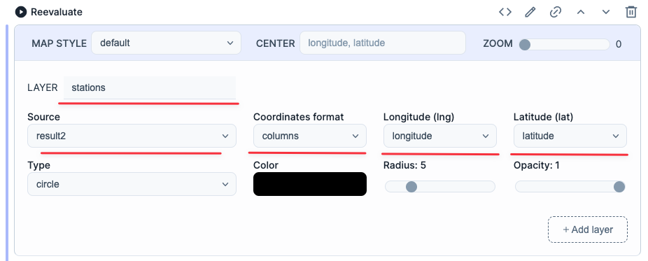
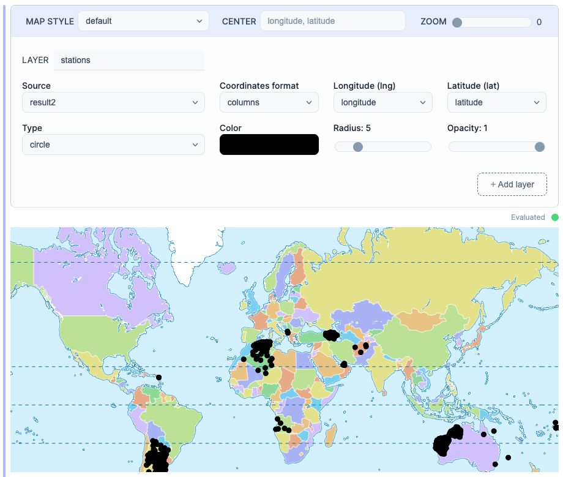

Livebook has built-in integrations with many data sources, including Amazon Athena.

In this blog post, you'll learn how to use Livebook to connect to Amazon Athena, execute a SQL query against it, and visualize the data.

You can also run this tutorial inside your Livebook instance by clicking the button below:

[](/run?url=https%3A%2F%2Fgithub.com%2Fhugobarauna%2Flivebook-notebooks%2Fblob%2Fmain%2Famazon_athena_integration.livemd)

## Connecting to Amazon Athena using the Database connection Smart cell

To connect to Amazon Athena, you'll need the following info from your AWS account:

*   AWS access key ID
*   AWS secret access key
*   Athena database name
*   S3 bucket to write query results to

Now, let's create an Amazon Athena connection using a Database connection Smart cell. Click the options "Smart > Database connection > Amazon Athena":



Once you've done that, you'll see a Smart cell with input fields to configure your Amazon Athena connection:



Fill in the following fields to configure your connection:

*   Add your AWS access key ID
*   Add your AWS secret access key
*   Add your Athena database name
*   Add your S3 bucket in the "Output Location" field

Now, click the "Evaluate" icon to run that Smart cell. Once you've done that, the Smart cell will configure the connection and assign it to a variable called `conn`.

## Querying Amazon Athena using the SQL Query Smart cell

Before querying Athena, we need to have an Athena table to query from. So, let's create one.

We'll create an Athena table based on a public dataset published on AWS Open Data. We'll use the [GHCN-Daily dataset](https://github.com/awslabs/open-data-docs/tree/main/docs/noaa/noaa-ghcn), which contains climate records measured by thousands of climate stations worldwide. Let's create an Athena table called `stations` with metadata about those climate stations.

To do that, Add a new SQL Query Smart cell by clicking the options "Smart > SQL Query":



Copy and paste the SQL code below to the SQL Query cell:

```sql
CREATE EXTERNAL TABLE IF NOT EXISTS default.stations (
  station_id string,
  latitude double,
  longitude double,
  elevation double,
  name string)
ROW FORMAT SERDE
  'org.apache.hadoop.hive.serde2.RegexSerDe'
WITH SERDEPROPERTIES (
  'input.regex'='([^ ]*) *([^ ]*) *([^ ]*) *([^ ]*) *(.+)$')
STORED AS INPUTFORMAT
  'org.apache.hadoop.mapred.TextInputFormat'
OUTPUTFORMAT
  'org.apache.hadoop.hive.ql.io.HiveIgnoreKeyTextOutputFormat'
LOCATION
  's3://livebook-blog/amazon-athena-integration'
TBLPROPERTIES (
  'typeOfData'='file')
```

Now, click the "Evaluate" icon to run that Smart cell. Now we have an Athena table to query from.

Add a new SQL Query Smart cell and copy and paste the following SQL query to it:

```sql
select * from default.stations order by station_id
```

Evaluate that cell. It will query your Athena table and assign the results to a `result2` variable. You'll see the result of that query in a tabular format like this:

## 

## Visualizing geographic coordinates data using the Map Smart cell

Notice that the table we created has each climate station's latitude and longitude information. We can visualize that data with a map visualization using the Map Smart cell. Let's do that.

Add a Map Smart cell by clicking the options "Smart > Map":



Your Map Smart cell will look something like this:



Use your Map Smart cell to configure:

*   the layer name
*   the data source
*   the coordinates format
*   the longitude field
*   the latitude field



Once you've configured the Smart cell, you can evaluate it, and it will build a map for you. It will look something like this:



That's it! Using Livebook Smart cells, you can connect to an Amazon Athena database, execute a SQL query against it and visualize the result.
