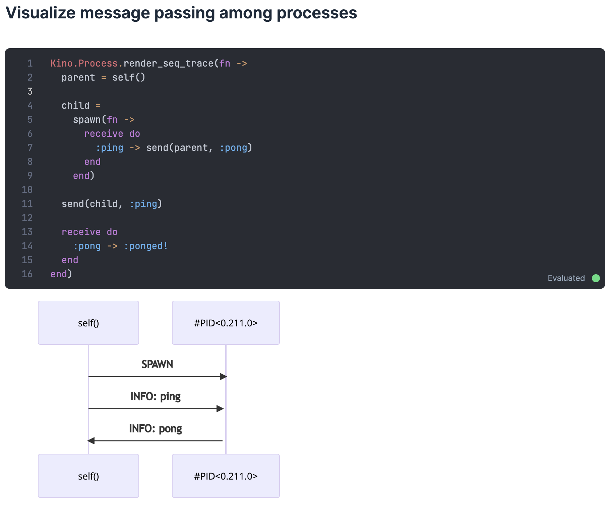
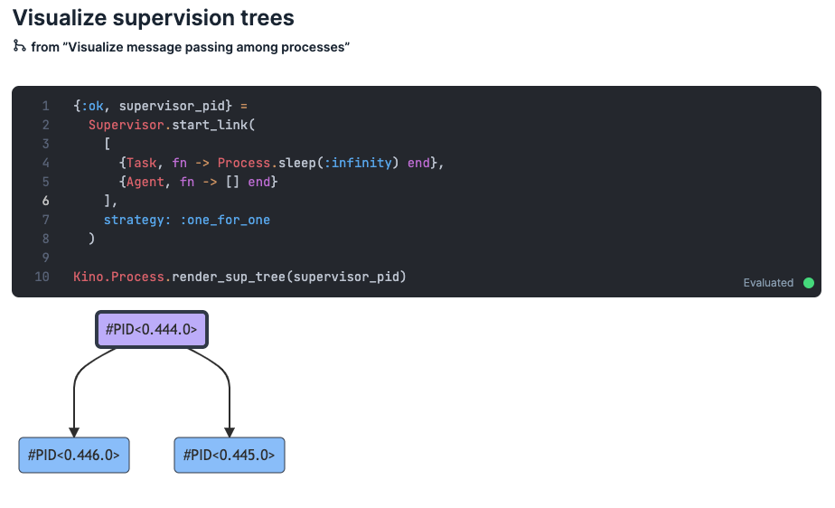

Livebook v0.7 is out! This is a major release coming with significant features in the following areas:

*   secret management
*   visual representations of the running system (supervision trees, inter-process messaging, and more)
*   an interactive user interface to visualize and edit Elixir pipelines

Let’s take a look at each of those.

We also created a video showing each one of those features:

<div class="embed">
  <iframe src="https://www.youtube.com/embed/lyiqw3O8d_A?rel=0" title="Video" allowfullscreen loading="lazy"></iframe>
</div>

## Secret management

We know that putting sensitive data in your code, like passwords and API keys, is a security risk. With this new v0.7 release, Livebook has an integrated way to help you deal with that. We’re calling it Secrets. Let’s see an example.

Let’s say you’re writing a notebook that consumes data from an API that requires authentication:

```elixir
api_username = "postman"
api_password = "password"

Req.get!("https://postman-echo.com/basic-auth", auth: {api_username, api_password})
```

This piece of code is hardcoding API username and password, but you want to avoid that. You can do that by creating two Livebook secrets, one for the API username and one for the API password:


Now, you can refactor your code to get the username and password values from those secrets by using `System.fetch_env!/1`:

```elixir
api_username = System.fetch_env!("LB_API_USERNAME")
api_password = System.fetch_env!("LB_API_PASSWORD")

Req.get!("https://postman-echo.com/basic-auth", auth: {api_username, api_password})
```

Notice that Livebook adds an `LB_` namespace to the environment variable name.

Let’s say you share with a co-worker that notebook that is using Livebook Secrets. If that person doesn’t have those secrets configured in their Livebook instance yet, when they run the notebook, Livebook will automatically ask them to create the required secrets! No more hidden secrets (pun intended 🤭). Here’s what it looks like:


The new Secrets feature is also already integrated with Database Connection Smart cells. When you’re creating a connection to PostgreSQL or Amazon Athena, Livebook will give you the option to use a Secret for the database password:


## Visual representations of the running system

One interesting aspect of coding is that it can feel like we’re “building castles in the air.” We can build something with our thoughts materialized by code, which is amazing!

But, because of the intangible nature of code, sometimes it can be hard to reason about it. When reading a piece of code, you’re simultaneously building a representation of how it works inside your mind. What if you could get some help with visualizing that?

That’s when the idea of “a picture is worth a thousand words” comes in handy.

Imagine someone who’s learning Elixir. The person is learning message passing between processes, and they are analyzing the following example:

```elixir
parent = self()

child =
  spawn(fn ->
        receive do
            :ping -> send(parent, :pong)
        end
    end)

send(child, :ping)

receive do
    :pong -> :ponged!
end
```

Instead of making the person create a representation of how that code works only through text, we could show them a visual representation of it.

Since [v0.5](/blog/v0-5-flowcharts-custom-widgets-intellisense-and-ui-improvements), Livebook has a way to show visual widgets to the user, through its [Kino package](https://github.com/livebook-dev/kino). And with this v0.7 release, we have a new Kino widget to show a visual representation of message passing between Elixir processes.

All you need to do is wrap your code with `Kino.Process.render_seq_trace/2`:



Seeing a visual representation of code is not only applicable when you’re just getting started with Elixir. Imagine, for example, you need to code something that performs a job concurrently, and you discover Elixir’s `Task.async_stream/3`. You read its documentation and understand its API, but you also want to learn more about how it orchestrates multiple processes. You could use Livebook to visualize that:


Besides visualizing message passing, you can now use Livebook to visualize a supervision tree. You can do that by calling the `Kino.Process.render_sup_tree/2` function with the supervisor’s PID:



Livebook will also automatically show you a supervision tree if your cell returns the PID of a supervisor:

This feature has been [contributed](https://github.com/livebook-dev/kino/pulls?q=is%3Apr+author%3Aakoutmos) by [Alex Koutmos](https://twitter.com/akoutmos), and it is a great example of how modern notebooks can benefit from an open-source community.

## Interactive user interface to visualize and edit Elixir pipelines

[Elixir 1.14](https://elixir-lang.org/blog/2022/09/01/elixir-v1-14-0-released/) came with a fantastic new feature for debugging called `dbg`. It can do many things, one of which is to help inspect a pipeline. So we thought, “how would dbg work inside Livebook?”

Maybe we could do some visualization of the pipeline, showing the result of each pipeline step, as the regular `dbg` does. But, since we’re already in a more visual environment, we went one step further. We built not only a visualization of an Elixir pipeline but also the ability to edit and interact with it!

Let’s say you run the following pipeline inside Livebook:

```elixir
"Elixir is cool!"
|> String.trim_trailing("!")
|> String.split()
|> List.first()
|> dbg()
```

When you do that, Livebook will show a widget that you can use to:

*   see the result of the pipeline
*   enable/disable a pipeline step
*   drag and drop a pipeline step to re-order the pipeline

Here’s what it looks like:


This can be very helpful if you’re trying to understand what each step of a pipeline is doing. [Ryo Wakabayashi](https://twitter.com/nakaji573) created a [cool example](https://qiita.com/RyoWakabayashi/items/7d9eff9df1041c705713) showing how that could be applied to a pipeline that is using Elixir to process an image using [Evision](https://github.com/cocoa-xu/evision):

```elixir
image_path
|> OpenCV.imread!()
|> OpenCV.blur!([9, 9])
|> OpenCV.warpAffine!(move, [512, 512])
|> OpenCV.warpAffine!(rotation, [512, 512])
|> OpenCV.rectangle!([50, 10], [125, 60], [255, 0, 0])
|> OpenCV.ellipse!([300, 300], [100, 200], 30, 0, 360, [255, 255, 0], thickness: 3)
|> Helper.show_image()
|> dbg()
```


## Other notable features and improvements

Besides those three big features, this new version contains many other news. You can check our GitHub repo’s changelogs to see everything that comes with this new version.

*   [Livebook’s changelog](https://github.com/livebook-dev/livebook/blob/main/CHANGELOG.md#v070-2022-10-07)
*   [Kino’s changelog](https://github.com/livebook-dev/kino/blob/main/CHANGELOG.md#v070-2022-10-07)
*   [KinoDB’s changelog](https://github.com/livebook-dev/kino_db/blob/main/CHANGELOG.md#v020-2022-10-07)

### Organize your cell output with a tab or grid layout

You can now use `Kino.Layout.tabs/1` to show the output of your cell in tabs. Here’s an example of how to do it:

```elixir
data = [
    %{id: 1, name: "Elixir", website: "https://elixir-lang.org"},
    %{id: 2, name: "Erlang", website: "https://www.erlang.org"}
]

Kino.Layout.tabs(
    Table: Kino.DataTable.new(data),
    Raw: data
)
```

Here’s what it looks like:


You can also use `Kino.Layout.grid/2` to show the output of your cell in a grid. Here’s an example of how to do it:

```elixir
urls = [
  "https://images.unsplash.com/photo-1603203040743-24aced6793b4?ixlib=rb-1.2.1&ixid=MnwxMjA3fDB8MHxwaG90by1wYWdlfHx8fGVufDB8fHx8&auto=format&fit=crop&w=580&h=580&q=80",
  "https://images.unsplash.com/photo-1578339850459-76b0ac239aa2?ixlib=rb-1.2.1&ixid=MnwxMjA3fDB8MHxwaG90by1wYWdlfHx8fGVufDB8fHx8&auto=format&fit=crop&w=580&h=580&q=80",
  "https://images.unsplash.com/photo-1633479397973-4e69efa75df2?ixlib=rb-1.2.1&ixid=MnwxMjA3fDB8MHxwaG90by1wYWdlfHx8fGVufDB8fHx8&auto=format&fit=crop&w=580&h=580&q=80",
  "https://images.unsplash.com/photo-1597838816882-4435b1977fbe?ixlib=rb-1.2.1&ixid=MnwxMjA3fDB8MHxwaG90by1wYWdlfHx8fGVufDB8fHx8&auto=format&fit=crop&w=580&h=580&q=80",
  "https://images.unsplash.com/photo-1629778712393-4f316eee143e?ixlib=rb-1.2.1&ixid=MnwxMjA3fDB8MHxwaG90by1wYWdlfHx8fGVufDB8fHx8&auto=format&fit=crop&w=580&h=580&q=80",
  "https://images.unsplash.com/photo-1638667168629-58c2516fbd22?ixlib=rb-1.2.1&ixid=MnwxMjA3fDB8MHxwaG90by1wYWdlfHx8fGVufDB8fHx8&auto=format&fit=crop&w=580&h=580&q=80"
]

images =
    for {url, i} <- Enum.with_index(urls, 1) do
        image = Kino.Markdown.new("")
    label =  Kino.Markdown.new("**Image #{i}**")
        Kino.Layout.grid([image, label], boxed: true)
    end

Kino.Layout.grid(images, columns: 3)
```

Here’s what it looks like:


### Universal desktop build for Mac and automated nightly builds

We made some improvements in the build process of Livebook Desktop.

First, we unified the Mac Intel and Mac Silicon download files into a single Mac Universal file. No need to ask yourself if you’re supposed to download the Intel or Silicon distribution. Pretty neat!

Second, we automated the build process of generating Livebok Desktop. We’re using that to do nightly builds of Livebook Desktop based on the main branch of our GitHub repo.

That means now you can use our [nightly builds](https://github.com/livebook-dev/livebook#desktop-app) to download Livebook Desktop and play with the new features we’re still working on before we launch a new release. 😉

## Try it!

To play with the new features all you need to do is:

1.  [Install the new Livebook version](/#install)
2.  Import [this notebook](https://github.com/hugobarauna/livebook-notebooks/blob/main/whats_new_in_livebook_v07.livemd) containing a demo of the new features

[](/run?url=https%3A%2F%2Fgithub.com%2Fhugobarauna%2Flivebook-notebooks%2Fblob%2Fmain%2Fwhats_new_in_livebook_v07.livemd)

Our team put a lot of effort into this new release, and we’re very excited about it! We hope you like it too.

Happy hacking!
