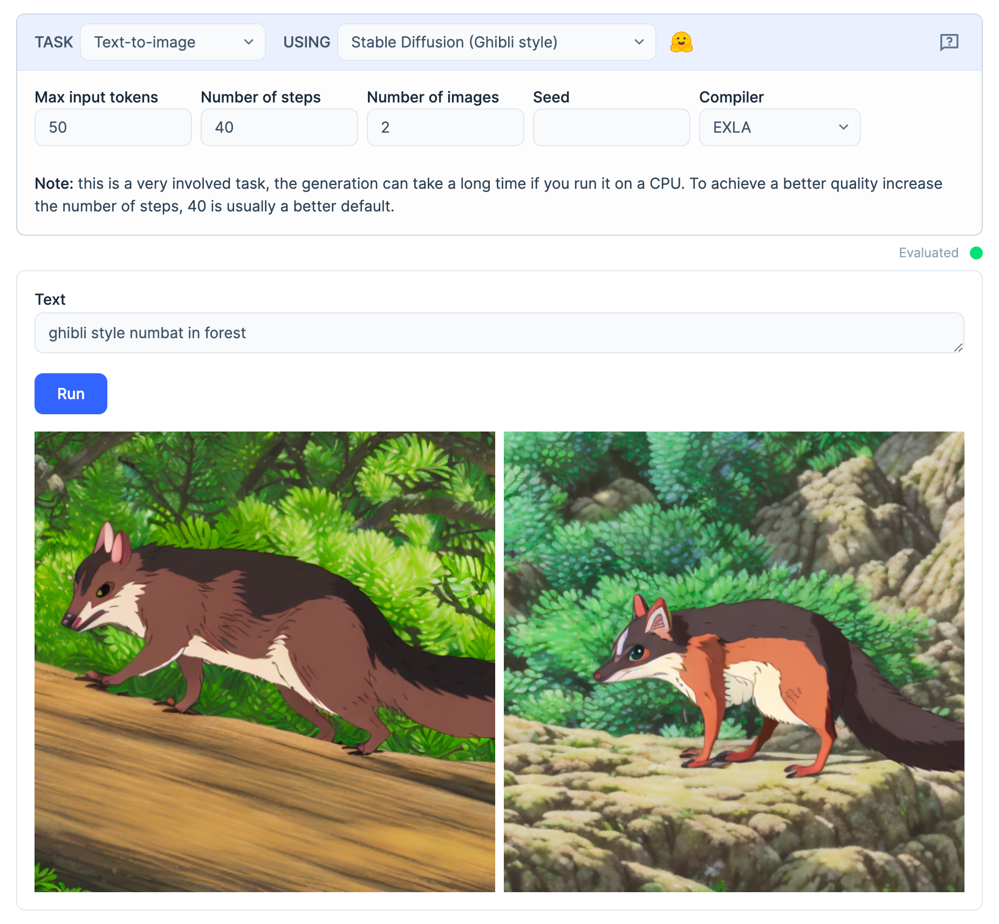
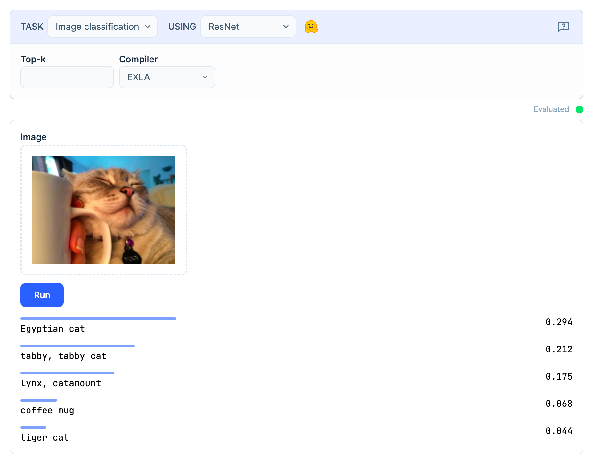
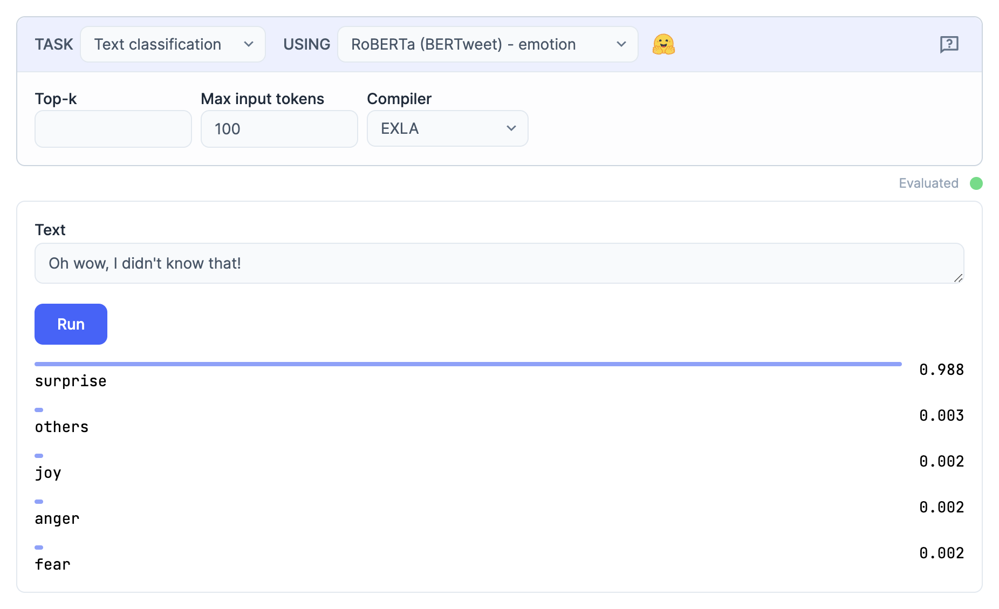
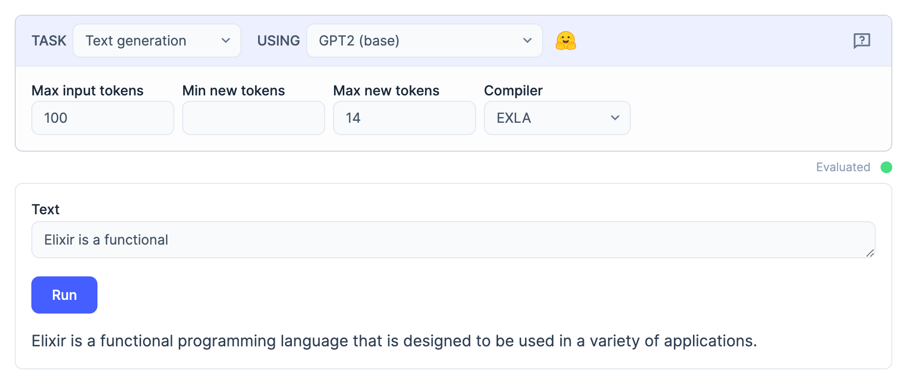

We are glad to announce a variety of Neural Networks models are now available to the Elixir community via [the Bumblebee project](https://github.com/elixir-nx/bumblebee).

We have implemented several models, from GPT2 to Stable Diffusion, in pure Elixir, and you can download training parameters for said models directly from [Hugging Face](https://huggingface.co/).

To run your first Machine Learning model in Elixir, all you need is three clicks, thanks to [our integration between Livebook and Bumblebee](https://github.com/livebook-dev/kino_bumblebee). You can also easily embed and run said models within existing Elixir projects.

Watch the video by José Valim covering all of these topics and features:

<div class="embed">
  <iframe src="https://www.youtube.com/embed/g3oyh3g1AtQ?rel=0" title="Video" allowfullscreen loading="lazy"></iframe>
</div>

## Running Machine Learning models with Livebook

Here are some examples of what it looks like to use [Livebook to run Machine Learning models](https://github.com/livebook-dev/kino_bumblebee):

### Text to image



### Image classification



### Text classification



### Text generation



## Incorporating models into any Elixir project

Thanks to the new [Nx.Serving](https://hexdocs.pm/nx/Nx.Serving.html) functionality, you should be able to incorporate those models into any existing project with little effort and run them at scale.

You should be able to embed and serve these models as part of your existing Phoenix web applications, integrate them into data processing pipelines with Broadway, and deploy them alongside Nerves embedded systems - without needing 3rd-party dependencies.

Here’s [an example](https://github.com/elixir-nx/bumblebee/blob/main/examples/phoenix/image_classification.exs) of using Bumblebee to run an image classification model inside a Phoenix app:

<div class="embed">
  <iframe src="https://www.youtube.com/embed/KYVeccxzqwQ?rel=0" title="Video" allowfullscreen loading="lazy"></iframe>
</div>

## Integration with Hugging Face

Bumblebee allows you to download and use trained models directly from Hugging Face. Let’s see [an example](https://github.com/elixir-nx/bumblebee/blob/main/notebooks/examples.livemd#text-generation) of how we can generate text continuation using the popular GPT-2 model:

```elixir
{:ok, gpt2} = Bumblebee.load_model({:hf, "gpt2"})
{:ok, tokenizer} = Bumblebee.load_tokenizer({:hf, "gpt2"})

serving = Bumblebee.Text.generation(gpt2, tokenizer, max_new_tokens: 10)

text = "Yesterday, I was reading a book and"
Nx.Serving.run(serving, text)

#=> %{
#=>    results: [
#=>        %{
#=>            text: "Yesterday I was reading a book and I was thinking, 'What's going on?'"
#=>        }
#=>    ]
#=> }
```

As you can see, we just load the model data and use a high-level function designed for the text generation task, that’s it!

## Compiling to CPU/GPU

All of our Neural Networks can be compiled to the CPU/GPU, thanks to projects such as [EXLA](https://github.com/elixir-nx/nx/tree/main/exla) (based on Google XLA) and [Torchx](https://github.com/elixir-nx/nx/tree/main/torchx) (based on Libtorch).

## A massive milestone in our Numerical Elixir effort

This release is a huge milestone in our Numerical Elixir effort, which started almost two years ago. These new features, in particular, are possible thanks to the enormous efforts of José Valim, Jonatan Kłosko, Sean Moriarity, and Paulo Valente. We are also thankful to Hugging Face for enabling collaborative Machine Learning across communities and tools, which played an essential role in bringing the Elixir ecosystem up to speed.

Next, we plan to focus on training and transfer learning of Neural Networks in Elixir, allowing developers to augment and specialize pre-trained models according to the needs of their businesses and applications. We also hope to publish more on our progress in developing traditional Machine Learning algorithms.

## Your turn

If you want to give Bumblebee a try, you can:

*   Download [Livebook v0.8](/) and automatically generate “Neural Networks tasks” from the “+ Smart” cell menu inside your notebooks.
*   We have also written [single-file Phoenix applications](https://github.com/elixir-nx/bumblebee/tree/main/examples/phoenix) as examples of Bumblebee models inside Phoenix (+ LiveView) apps. Those should provide the necessary building blocks to integrate Bumblebee into your production app.
*   For a more hands-on approach, read some of our [notebooks](https://github.com/elixir-nx/bumblebee/tree/main/notebooks).

If you want to help us build the Machine Learning ecosystem for Elixir, check out the projects above, and give them a try. There are many exciting areas, from compiler development to model building. For instance, pull requests that bring more models and architectures to Bumblebee are welcome. The future is concurrent, distributed, and fun!
