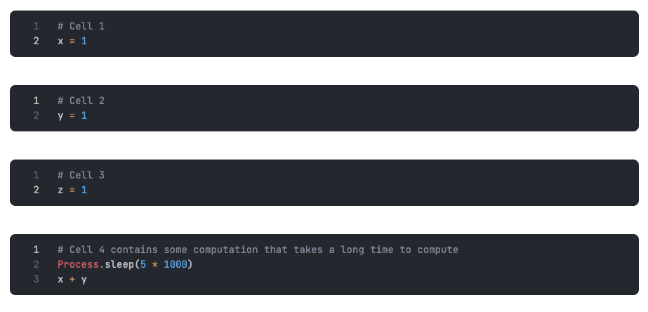

Livebook 0.8 [was launched a few weeks ago](/blog/announcing-bumblebee-gpt2-stable-diffusion-and-more-in-elixir), and the highlight of that release was the new Neural Network Smart cell. But there are many other exciting updates included as well.

In this blog post, we will showcase ten of the most noteworthy features released with Livebook 0.8.

## New mechanism for tracking how cells depend on each other

A [known pain point](https://www.microsoft.com/en-us/research/publication/whats-wrong-with-computational-notebooks/) of computational notebooks is reproducibility. But Livebook already solved that by enabling truly reproducible workflows. This was accomplished by the fact that the Livebook execution model is fully sequential, and there is no global mutable state.

Still, there was a downside with that fully sequential model. Whenever a cell was evaluated, all subsequent cells were marked as stale and required reevaluation. That happened regardless of whether those cells depended on the evaluated cell.

Not anymore!

This new release now tracks how cells depend on each other and only marks subsequent cells as stale if necessary. Let's see how that works.

Let's say you have four code cells like that:

Look how cell 4 depends on cell 1 and cell 2, but doesn't depend on cell 3. And notice how cell 4 simulates a computation that takes some time to finish.

Before Livebook 0.8, if you changed cell 3, cell 4 would become stale, even though cell 4 didn't depend on cell 3. And you'd need to reevaluate it:

With Livebook 0.8, when you change cell 3, Livebook knows that although cell 4 is subsequent to cell 3, it doesn't depend on it, so it doesn't mark cell 4 as stale anymore:

No more need to waste time waiting for unnecessary cell reevaluation!

## Automatic execution of doctests

One cool feature of Elixir is Doctests. It helps you ensure that your documentation is up to date with your code.

This new release integrates Doctests natively into Livebook.

Now, whenever you evaluate a cell that contains a module definition with doctests, Livebook will automatically run those doctests for you and will show you the output:

We're planning to streamline that workflow even more in future releases.

## Render math in on-hover documentation

Elixir has an [amazing developer experience](https://elixir-lang.org/blog/2022/12/22/cheatsheets-and-8-other-features-in-exdoc-that-improve-the-developer-experience/) when it comes to documentation. And Livebook aims to leverage that.

Before this new release, Livebook already supported seeing the documentation of a module or function when you hover over it:

Now, the on-hover documentation also supports those fancy math documentation of yours (based on [KaTeX](https://katex.org/))

## View and delete secrets in the sidebar

Livebook 0.7 [introduced secret management](/blog/whats-new-in-livebook-0-7). A solution to help you manage sensitive data used by your notebooks, like passwords and API keys.

With this new release, you can also view and delete those secrets in the notebook sidebar:

## Support for image input

Livebook enables you to add [a variety of user inputs](https://hexdocs.pm/kino/Kino.Input.html) to your notebooks, making them interactive and parametrizable.

This new release comes with a [new input that allows the user of your notebook to upload images](https://hexdocs.pm/kino/Kino.Input.html#image/2):

## Visualization of nested data as a tree view

Inspecting a nested data structure can be hard when it gets big. For example, when you want to check the result of an HTTP API call.

With Kino 0.8 that accompanies the Livebook release, you can now visualize and inspect nested data in a tree view, so it gets easier to understand it:

This was a [community contribution](https://github.com/livebook-dev/kino/pull/208) by [Stefan Chrobot](https://twitter.com/StefanChrobot). He started the project during [Spawnfest](https://spawnfest.org/) and won 2nd place overall. Shout out to him!

## Neural Network Smart cell

We discussed that new feature in detail [in a previous post](/blog/announcing-bumblebee-gpt2-stable-diffusion-and-more-in-elixir). But it's so cool that we thought it was worth mentioning it again here.

That new Smart cell allows you to run various machine learning models directly in Livebook with just a few clicks. Here's an example of a text classification model:

## Slack Message Smart cell

Let's say you want to send a notification to your Slack after your notebook completes some automation.

With the new Slack Smart cell, that's dead easy:

## Geocoding in Map Smart cell

The Map Smart cell got even better. Now besides accepting data as latitude and longitude, you can also use the names of countries, states, cities, counties, and streets.

Let's see how that works:

## More options to configure charts with the Chart Smart Cell

We added new options to help you customize your charts even more.

You can now toggle the **bin** config to discretize numeric values into a set of bins. This is useful for creating histograms, for example. Here's how it works:

Another new option is the **color scheme**. You can now choose your chart's color from a set of named color palettes. Here's how it works:

Last but not least, let's check the new **scale config**. You can use it to change the scale type of your chart, for example, from a linear to a log scale. Let's see how it works:

## Try it!

To play with the new features, all you need to do is:

*   [Install](/#install) the new Livebook version
*   Import a notebook containing a demo of the new features by clicking on the badge below

Happy hacking!
