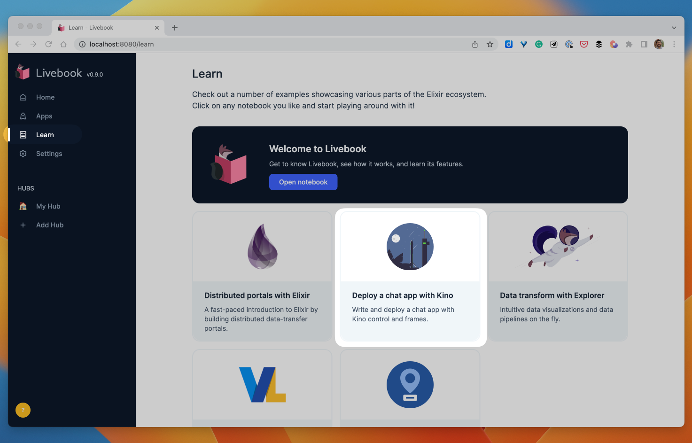

Welcome to the first-ever Livebook Launch Week! 🎉

We’re kicking off this series of announcements to unveil the fantastic new features available in Livebook 0.9. Starting today, each day of this week, we’ll announce a new feature or something new you can do with this new Livebook release, version 0.9.

And today, we’re thrilled to announce the most prominent feature of this new release, the ability to run your notebook as an app.

  <iframe src="https://www.youtube.com/embed/q7T6ue7cw1Q?rel=0" title="Video" allowfullscreen loading="lazy"></iframe>

## Deploy Livebook notebooks as apps

Although Livebook is terrific for many use cases where you need to use it just by yourself, we always believed it could shine in contexts where multiple people are collaborating through it.

When Livebook was launched, it already came with real-time collaboration, allowing multiple people to edit a notebook simultaneously. This was already one step ahead of the traditional concept of a code notebook. But we thought it could go even further.

There are some scenarios where you want people to use your notebook but not necessarily edit it. In those scenarios, the person wants to run and interact with your notebook. That’s why we created and evolved Kino, a tool that enables you to build interactive notebooks.

Although Kino made your notebook interactive, it still felt like a notebook. The person could still see all the code cells mixed with the interactive widgets and the outputs. And this is not the best UX for sharing your notebook with people that need to use it but not edit it.

But now, we have a better way.

Now, you can deploy your notebook as an app! 🎉

This is a way to turn your Livebook notebook into a user-friendly application!

  <iframe src="https://www.youtube.com/embed/Castmvhx5Nc?rel=0" title="Video" allowfullscreen loading="lazy"></iframe>

A deployed notebook is a web app that only shows the inputs and outputs of your notebook and is powered by your notebook code.

This allows you to share your notebook with a broader audience, making it more accessible to non-technical users or those unfamiliar with Livebook.

You can build internal apps, a demo of a Machine Learning model, or interactive automation tasks.

But in truth, we can’t imagine all the different ways you will use that, and we can’t wait to see what you will build with this new feature!

To get started, inside the Livebook’s Learn section, there’s a new notebook that will teach you how to write and deploy your first app: a chat application in only 15 lines of code!

## Quality-of-life improvements

### Star a notebook

This is for all of us who need to open a notebook multiple times per day or week and want to avoid repeatedly navigating the whole file directory structure to open that notebook every single time. Not anymore!

Now, you can star a notebook, and starred notebooks will show in your Livebook’s Home.

  <iframe src="https://www.youtube.com/embed/A2Pl7A-FRcM?rel=0" title="Video" allowfullscreen loading="lazy"></iframe>

Shout out to [ByeongUk Choi](https://github.com/ByeongUkChoi) for [adding that feature](https://github.com/livebook-dev/livebook/pull/1639) as a community contributor.

### Recent notebooks

We revamped the “Opening a notebook” user flow.

Now all the ways of opening a notebook are centralized. And in that “Open notebook” page, we added a new section: “Recent notebooks.”

This section lists all the latest notebooks you’ve been working on, making it very easy to find recently used notebooks and quickly resume what you have been doing with Livebook since the last time you opened it.

  <iframe src="https://www.youtube.com/embed/aERilOCDUKI?rel=0" title="Video" allowfullscreen loading="lazy"></iframe>

Shout out to [ByeongUk Choi](https://github.com/ByeongUkChoi) for [adding that feature](https://github.com/livebook-dev/livebook/pull/1639) as a community contributor.

### Collapse sections

Finding a specific section within your notebook can take more than a single mouse scroll when your notebook gets large.

The new “collapse sections” feature lets you toggle the visibility of the cells of sections so you can focus on particular parts of the notebook you’re working on.

  <iframe src="https://www.youtube.com/embed/m3kfyfn_DNM?rel=0" title="Video" allowfullscreen loading="lazy"></iframe>

Shout out to [Jannik Becher](https://github.com/jannikbecher) for [adding that feature](https://github.com/livebook-dev/livebook/pull/1772) as a community contributor.

## What now?

We encourage you to go ahead and [install Livebook’s latest version](/#install) to build and deploy your first Livebook app!

And if you have any comments or want to share what you’ve built using Livebook, you can [tweet using the #LivebookLaunchWeek](https://twitter.com/intent/tweet?text=I%27m%20loving%20the%20new%20Livebook%200.9!%20%23LivebookLaunchWeek) hashtag.

Stay tuned for the following announcement of the Livebook Launch Week!

## More Launch Week

*   [Day 2: Distributed² Machine Learning notebooks with Elixir and Livebook](/blog/distributed2-machine-learning-notebooks-with-elixir-and-livebook-launch-week-1-day-2)
*   [Day 3: Hubs and secret management](/blog/hubs-and-secret-management-launch-week-1-day-3)
*   [Day 4: Build and deploy a Whisper chat app to Hugging Face in 15 minutes](/blog/build-and-deploy-a-whisper-chat-app-to-hugging-face-in-15-minutes-launch-week-1-day-4)
*   [Day 5: Data wrangling in Elixir with Explorer, the power of Rust, the elegance of R](/blog/data-wrangling-in-elixir-with-explorer-the-power-of-rust-the-elegance-of-r-launch-week-1-day-5)
