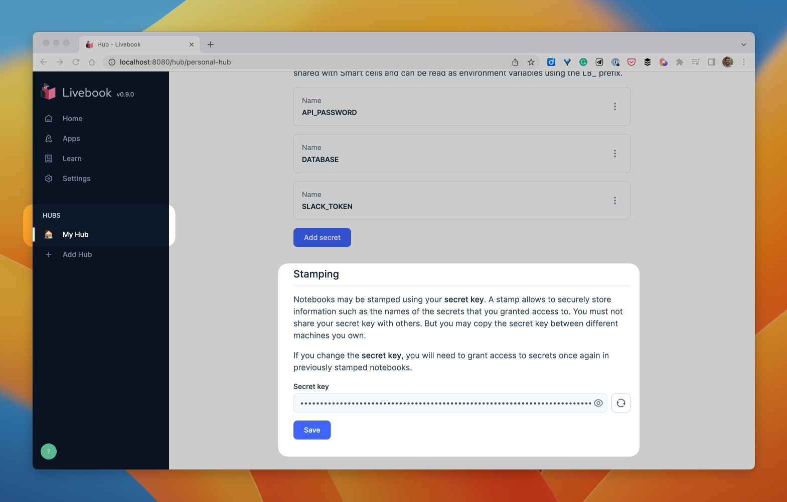

Welcome to the third day of Livebook Launch Week! 🎉

In today’s post, we’ll explore the new security features in Livebook 0.9, including the introduction of Hubs for centralized secret management and notebook stamping to enhance user experience while maintaining security.

Let’s dive in and discover how these features can improve your workflow and secure your notebooks!

  <iframe src="https://www.youtube.com/embed/IZzPquWl5Yw?rel=0" title="Video" allowfullscreen loading="lazy"></iframe>

## What’s wrong with computational notebooks?

Throughout the development of Livebook, one of the sources that [informed our roadmap](https://github.com/livebook-dev/livebook/issues/1223) was a paper published in 2020 called [“What’s Wrong with Computational Notebooks? Pain Points, Needs, and Design Opportunities”](https://www.microsoft.com/en-us/research/publication/whats-wrong-with-computational-notebooks/). The paper shows that computational notebook users face numerous pain points while using that kind of tool. One of those problems is security.

The paper defines that problem as follows:

> Maintaining data confidentiality and access control is an ad hoc, manual process where errors can leak private client data

Here’s a quote about that problem by one of the people interviewed by the researchers:

> We are missing a more private way of handling credentials. I don’t want client credentials be visible to others

To address that pain point, we [added built-in secret management to Livebook since version 0.7](/blog/whats-new-in-livebook-0-7).

Livebook’s built-in secret management allows your notebook to use sensitive data without hardcoding it. For example, imagine your notebook needs to use a password-protected API; this is how you’d save that password using Livebook Secrets from version 0.7:

  <iframe src="https://www.youtube.com/embed/laG04lxagZI?rel=0" title="Video" allowfullscreen loading="lazy"></iframe>

As you create more and more notebooks and more secrets, you’ll eventually want to see all the secrets you created. But before Livebook 0.9, the only way to see all the secrets you configured was inside a notebook.

Now, we have a better way.

## Livebook Hubs

This new Livebook release introduces a concept we’re calling Hubs.

Every new Livebook installation comes with a default personal Hub. This is the place where Livebook will save your secrets and where you can manage all of them. Let’s see how it works.

  <iframe src="https://www.youtube.com/embed/IH-xG9NKYYo?rel=0" title="Video" allowfullscreen loading="lazy"></iframe>

But a Hub is not only a place to centralize your secrets. When you visit your personal Hub, you’ll notice another section called Stamping.

## Notebook stamping

Before explaining this feature, let’s discuss why we created it.

Imagine the following scenario. You have a secret in your Livebook called “API\_PASSWORD.” If you download a notebook from the internet, you don’t want that secret to be accessible by that notebook by default. That’s why you must explicitly share a Livebook secret with a notebook.

But what if you were opening a notebook you created and had already shared secrets with that notebook? Although you already trust that notebook, Livebook would still make you explicitly share secrets with it every single time you open it. Let’s watch a video that illustrates that UX problem:

  <iframe src="https://www.youtube.com/embed/Lbm8k8Oy3ao?rel=0" title="Video" allowfullscreen loading="lazy"></iframe>

Enters notebook stamping.

Livebook 0.9 automatically stamps your notebooks so you don’t need to share a secret more than once with a notebook you trust. The notebook stamp contains the list of the secret names you explicitly shared with the notebook, and it’s encrypted using your secret key saved in your personal Hub.

Let’s see a video of how that new feature improves the UX of Livebook Secrets.

  <iframe src="https://www.youtube.com/embed/Cc-AOJU6Mrs?rel=0" title="Video" allowfullscreen loading="lazy"></iframe>

We also use the notebook source itself to generate the stamp, so someone can’t get your stamp and go stamping other notebooks, pretending it’s yours.

Since the stamping uses the secret key saved in your personal Hub, if you’re using Livebook on multiple machines and want to share notebooks between them, you can configure them with the same secret key.

With this update to Livebook’s security capabilities, we aim to ensure users can enjoy a secure working environment without compromising on ease of use.

## What now?

We encourage you to go ahead and [install Livebook’s latest version](/#install) so you can have a better user experience while maintaining the security of your notebooks.

And if you have any comments or want to share what you’ve built using Livebook, you can [tweet using the #LivebookLaunchWeek](https://twitter.com/intent/tweet?text=I%27m%20loving%20the%20new%20Livebook%200.9!%20%23LivebookLaunchWeek) hashtag.

Stay tuned for the following announcement of the Livebook Launch Week!

## More Launch Week

*   [Day 1: Deploy notebooks as apps & quality-of-life upgrades](/blog/deploy-notebooks-as-apps-quality-of-life-upgrades-launch-week-1-day-1)
*   [Day 2: Distributed² Machine Learning notebooks with Elixir and Livebook](/blog/distributed2-machine-learning-notebooks-with-elixir-and-livebook-launch-week-1-day-2)
*   [Day 4: Build and deploy a Whisper chat app to Hugging Face in 15 minutes](/blog/build-and-deploy-a-whisper-chat-app-to-hugging-face-in-15-minutes-launch-week-1-day-4)
*   [Day 5: Data wrangling in Elixir with Explorer, the power of Rust, the elegance of R](/blog/data-wrangling-in-elixir-with-explorer-the-power-of-rust-the-elegance-of-r-launch-week-1-day-5)
