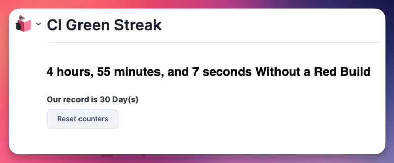
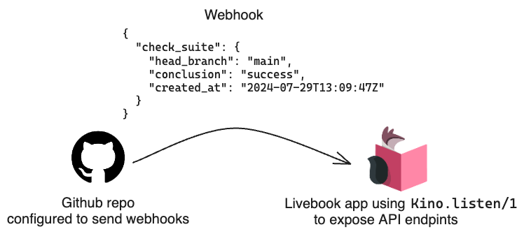

We are thrilled to announce the release of a new version of Livebook!

This version includes numerous new features and improvements. Today, we will highlight one of the most significant additions: `Kino.Proxy`.

By using `Kino.Proxy`, you can now expose API endpoints directly from your notebook or Livebook app.

Let's take a look at how it works.

## How to expose an API endpoint from your Livebook notebook

Here's a simple "hello world" example:

```elixir
Kino.Proxy.listen(fn conn ->
  Plug.Conn.send_resp(conn, 200, "hello world!")
end)
```

The `Kino.Proxy.listen/1` function makes Livebook expose API endpoints and will proxy requests to the handler function passed to it.

That handler function receives a `Plug.Conn` as an argument and should use the [Plug API](https://hexdocs.pm/plug/readme.html) to send a response to the client.

Let's see a video with a simple example working:

<div class="embed">
  <iframe src="https://www.youtube.com/embed/vbh2RVkywig?rel=0" title="Video" allowfullscreen loading="lazy"></iframe>
</div>

## Leveraging Plug for APIs with Kino.Proxy

You can also provide a module plug as an argument to `Kino.Proxy.listen/1`, like this:

```elixir
defmodule MyPlug do
  def init([]), do: false

  def call(conn, _opts) do
    Plug.Conn.send_resp(conn, 200, "hello world!")
  end
end

Kino.Proxy.listen(MyPlug)
```

Since our API handler is a plug, we can leverage other plugs. For example, here's how to use `Plug.Router` to handle multiple endpoints:

```elixir
defmodule ApiRouter do
  use Plug.Router

  plug :match
  plug :dispatch

  get "/hello" do
    send_resp(conn, 200, "hello from router")
  end

  get "/echo/:message" do
    send_resp(conn, 200, String.upcase(message))
  end

  match _ do
    send_resp(conn, 404, "oops, not found")
  end
end

Kino.Proxy.listen(ApiRouter)
```

## Livebook apps + Kino.Proxy = handling requests from external apps

This new feature enables an exciting new possibility: a Livebook app can now use `Kino.Proxy` to handle external HTTP requests, allowing code execution triggered by an external system.

Let’s see an example.

We built a Livebook app that tracks how many days we don't have a broken build in a GitHub repository:



Whenever a new build finishes in the configured Github Repo, GitHub sends a webhook to the Livebook app, which processes the request to update its state.



To handle webhooks inside the Livebook app, we could combine `Plug.Router` with `Kino.listen/1` like this:

```elixir
defmodule ApiRouter do
  use Plug.Router

  plug(:match)
  plug(Plug.Parsers, parsers: [:json], json_decoder: Jason)
  plug(:dispatch)

  post "/webhook" do
    process_webhook(conn.body_params)

    conn
    |> put_resp_content_type("application/json")
    |> send_resp(200, ~s({"message": "ok"}))
  end

  match _ do
    conn
    |> put_resp_content_type("application/json")
    |> send_resp(404, ~s({"message": "not found"}))
  end

  defp process_webhook(webhook_payload) do
    # Logic to do something with the webhook payload
  end
end

Kino.Proxy.listen(ApiRouter)
```

Here's a quick video with a demo of that app:

<div class="embed">
  <iframe src="https://www.youtube.com/embed/vWtE66XEAFM?rel=0" title="Video" allowfullscreen loading="lazy"></iframe>
</div>

Here's the [source code for that Livebook app](https://github.com/hugobarauna/livebook-notebooks/blob/main/ci_green_streak.livemd) so you can understand how it works under the hood.

If you want to run the app by yourself, [click here](/run/?url=https%3A%2F%2Fgithub.com%2Fhugobarauna%2Flivebook-notebooks%2Fblob%2Fmain%2Fci_green_streak.livemd).

## Wrapping up

We believe that APIs with `Kino.Proxy` open Livebook to a new category of use cases.

For example, you can quickly build an API that receives a request from Zapier to automate internal processes.

We're looking forward to seeing what you will build it with!

One last thing: Livebook 0.13 has plenty more, and you can view all of them in our [changelog](https://github.com/livebook-dev/livebook/blob/v0.13/CHANGELOG.md).

We plan to share quicker demos of other Livebook 0.13 features on [our X/Twitter, so feel free to follow us there](https://x.com/livebookdev).

Happy hacking!
