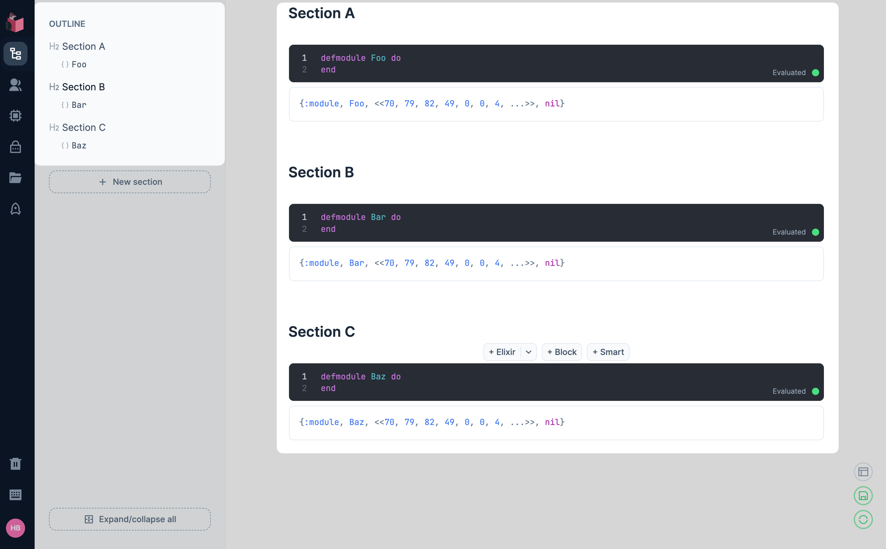
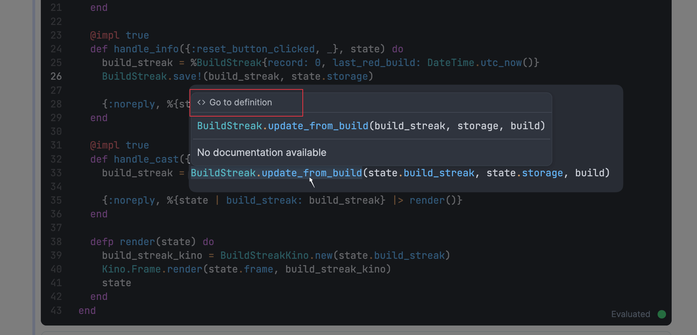

Livebook v0.14 is here with new features that make navigating your code easier than ever.

No more endless scrolling through a notebook to find module or function definitions — Livebook v0.14 has you covered.

## Module definitions in the Outline panel

When you define an Elixir module in a code cell, it will now be listed in the Outline panel in the sidebar.

The Outline panel, previously known as the Sections panel, now gives you a structured view of your code. It lists all the modules defined within each section of your notebook.

You can also use this panel to navigate to module definitions. Just click on a module's name on the Outline, and your notebook will automatically scroll to the position where it is defined.

Here's a video showing how it works:

  <iframe src="https://www.youtube.com/embed/hwyxsyrLp0o?rel=0" title="Video" allowfullscreen loading="lazy"></iframe>

Want to see how we built this? Here's the [pull request](https://github.com/livebook-dev/livebook/pull/2760).

## Go to definition of modules and functions

Not only can you quickly navigate to the definition of a module, but you can also quickly go to the definition of a function.

To do that, hover over a module or function you defined in your notebook, hold Command ⌘ (for macOS) or Ctrl (for Windows/Linux), and click on the module or function call.

Here's a video showing how it works:

  <iframe src="https://www.youtube.com/embed/aJE-ZskJ-20?rel=0" title="Video" allowfullscreen loading="lazy"></iframe>

You can also access this feature through the link shown in the intellisense for a module or function call:

Want to see how we built this? Here are the pull requests: [#2730](https://github.com/livebook-dev/livebook/pull/2730), [#2741](https://github.com/livebook-dev/livebook/pull/2741).

## Conclusion

We're dedicated to continually improving the Livebook developer experience, and these new features are another step in that journey.

Feel free to [check out the v0.14 changelog](https://github.com/livebook-dev/livebook/blob/v0.14/CHANGELOG.md) to discover all the features and changes in this newest release.

Happy hacking!
