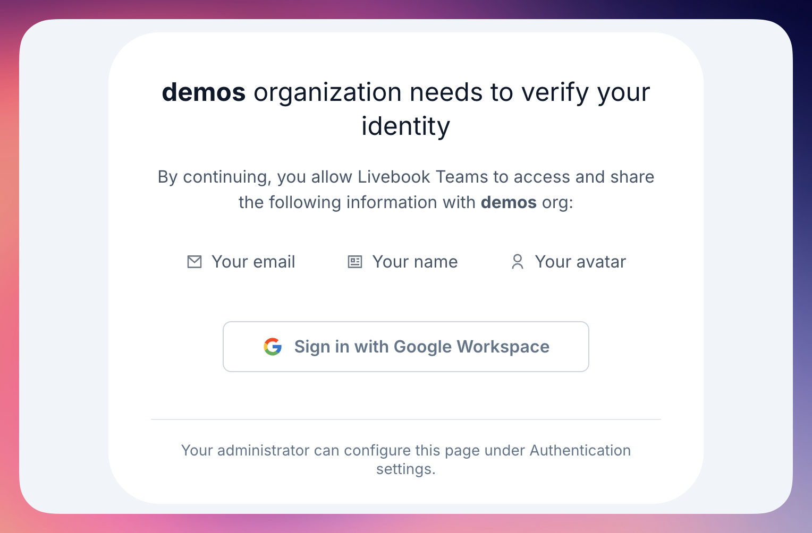
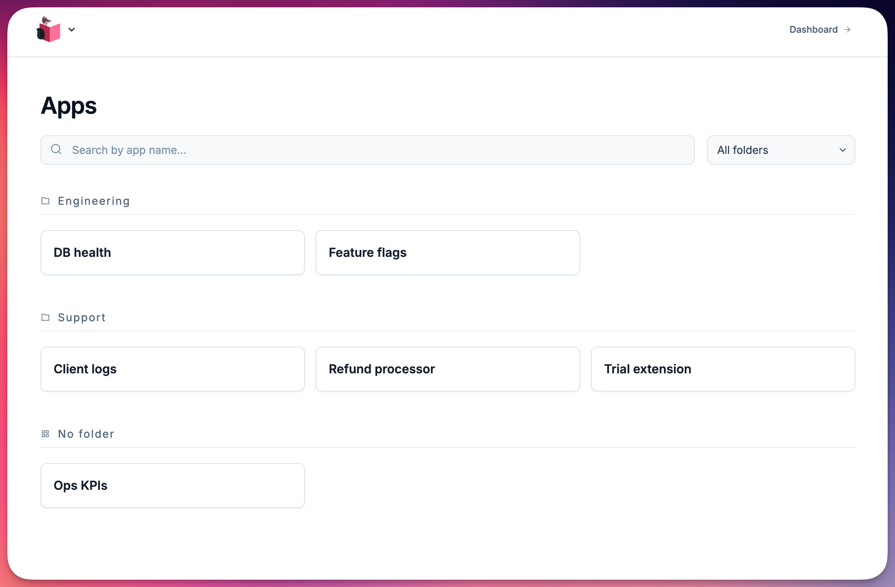
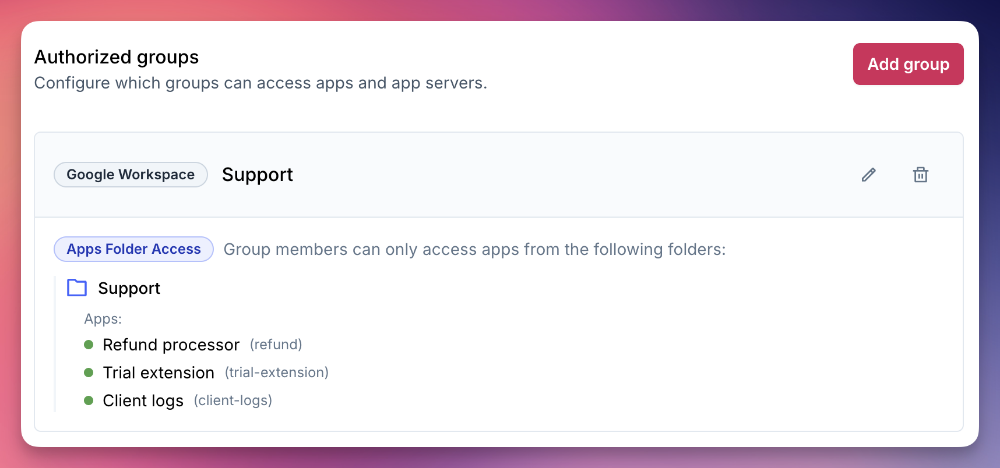
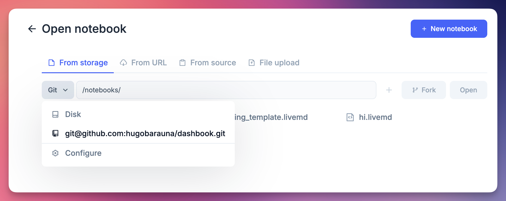
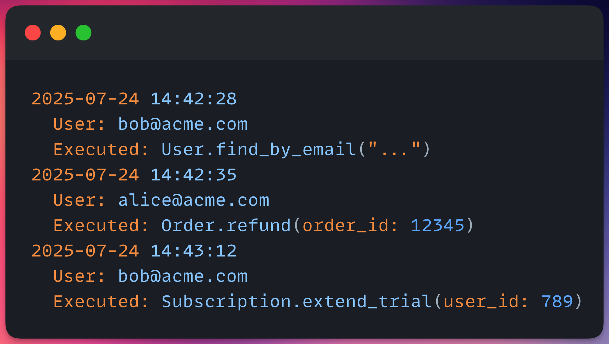

We're excited to share a batch of new features in Livebook Teams to help you manage access and keep your deployed apps organized.

Here's what's new.

## Google Workspace integration for authentication and access control

Control access to your Livebook apps and servers using your existing Google Workspace groups.

Manage access right from Google Workspace. Add someone to a group, and they instantly get access to the right apps in Livebook Teams.

To get started, set up Google Workspace as your SSO provider in Livebook Teams, then map your Google groups to control access at the app server or app level.

Check the [docs for setup instructions](https://hexdocs.pm/livebook/oidc_sso.html#1-oidc-configurations).

## Redesigned apps page with folders and search

The new deployed apps page helps you stay organized as your collection of internal tools grows.

[Organize apps into folders](https://hexdocs.pm/livebook/app_folders.html), search by name, and filter by folder. Quickly find the runbook or admin tool you need without scrolling through long lists.

## Access control by app folder

[Control who can access apps in each folder](https://hexdocs.pm/livebook/oidc_groups.html#access-types-explained) once you've organized them.

For example, give your ops team access to a "production-runbooks" folder, while your support team can use a "support-tools" folder.

Combine this with Google Workspace integration to map folders to Google groups for seamless access management.

## Open notebooks from your Git repository

[Open notebooks directly from your private Git repository](https://hexdocs.pm/livebook/git_file_storage.html) inside your Livebook app server.

This is great for template notebooks and runbooks you version in Git. Your team can browse and open them straight from the repository, no manual imports needed.

## Audit logs documentation

We now have full [documentation on audit logs](https://hexdocs.pm/livebook/audit_logs.html), showing how to track who ran what code and when.

Audit logs are essential for production. When someone runs a runbook that changes production data or system state, you'll have a clear record of who did it and when.

## Try it out

To start using these features, update to Livebook v0.18 or newer and configure them in your Teams organization settings.
